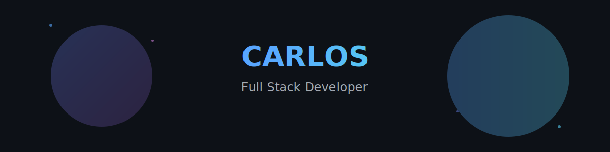
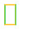
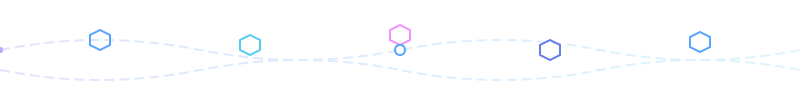
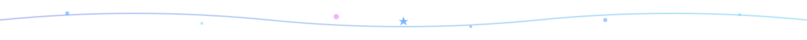

<!-- Animated Header with Gradient -->

<!-- Typing Animation SVG -->

 
 

<!-- Animated Wave -->

### Hey there! I'm Carlos
#### Full Stack Developer | Tech Enthusiast | Problem Solver

<!-- About Me Section with iOS Cards -->

## 🚀 About Me

<table>
<tr>
<td width="80%">

<!-- Code Snippet in iOS Terminal Style -->

 

 
 

</td>
<td width="50%">

</td>
</tr>
</table>

<!-- Tech Stack with Animated Icons -->

## 💻 Tech Stack

<!-- Main Technologies -->

  

<!-- Frontend -->

<b>🎨 Frontend Development</b>

 

  
    
  
  
  
  
  

<!-- Backend -->

<b>⚙️ Backend Development</b>

 

  
    
  

<!-- Cloud & DevOps -->

<b>☁️ Cloud & DevOps</b>

 

  
    
  

<!-- Tools -->

<b>🛠️ Tools & Others</b>

 

  

<!-- Stats Section with Glass Morphism Effect -->

## 📊 GitHub Statistics

<!-- Contribution Graph -->
 

<!-- Snake Animation -->
<picture>
  <source media="(prefers-color-scheme: dark)" srcset="https://raw.githubusercontent.com/carlos/carlos/output/github-contribution-grid-snake-dark.svg">
  <source media="(prefers-color-scheme: light)" srcset="https://raw.githubusercontent.com/carlos/carlos/output/github-contribution-grid-snake.svg">
  
</picture>

<!-- Connect Section -->

## 🌐 Let's Connect

  
  
  
  
  

 

<!-- Profile Views Counter -->

<!-- Latest Blog Posts -->

## 📝 Latest Blog Posts

<!-- BLOG-POST-LIST:START -->
<!-- BLOG-POST-LIST:END -->

<!-- Random Quote -->

<!-- Footer -->

### 💭 Random Developer Joke

 

---

   
  <b>Made with passion by Carlos</b>
  

 

 
 

